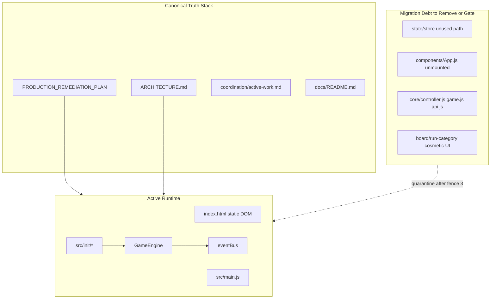

# JeoPARODY Carmack Cofounder Triage Plan

## Executive Verdict

JeoPARODY has the right product thesis and a **good plan already written** — but the repo is suffering from **three parallel realities**:

1. **Runtime reality**: Static DOM + `GameEngine` + `src/init/*` is the live app ([ARCHITECTURE.md](ARCHITECTURE.md)); Redux/components layer is built but unmounted.
2. **Documentation reality**: May/June 2026 convergence docs are aligned; onboarding paths (`Gemini.md`, [README.md](README.md) architecture section, [coordination/active-work.md](coordination/active-work.md)) still describe the old world.
3. **Git reality**: `main` last moved Oct 2025; real work is on `cleanup/production-readiness` (+3 commits, large dirty tree). Remote branches are stale experiments.

**Carmack rule applied**: Stop adding plans. Make one truth stack, one boot path, one score path, one doc index — then ship.



---

## Part 1: Documentation Inventory (43 markdown files)

### Tier 1 — Canonical (keep current, link everywhere)

| File | Role |
|------|------|
| [docs/PRODUCTION_REMEDIATION_PLAN_2026-05-26.md](docs/PRODUCTION_REMEDIATION_PLAN_2026-05-26.md) | **Single execution roadmap** (Fences 0–7) |
| [ARCHITECTURE.md](ARCHITECTURE.md) | Where code belongs **today** |
| [docs/README.md](docs/README.md) | Docs index + health snapshot |
| [docs/SOURCE_MATERIAL_INDEX.md](docs/SOURCE_MATERIAL_INDEX.md) | JeoPARODY vs Jeopardish map |
| [docs/SALVAGE_REGISTER.md](docs/SALVAGE_REGISTER.md) | What to mine from Jeopardish |
| [docs/CARMACK_CONVERGENCE_REVIEW.md](docs/CARMACK_CONVERGENCE_REVIEW.md) | Product tuning lens (not execution gates) |
| [coordination/active-work.md](coordination/active-work.md) | Work claims (needs pruning) |
| [AGENTS.md](AGENTS.md) | Agent protocol |

### Tier 2 — Subsystem guides (keep in `docs/`, update pointers only)

- [docs/AI_PROVIDER_SETUP.md](docs/AI_PROVIDER_SETUP.md), [docs/CSS.md](docs/CSS.md), [docs/MEDIA_RENDERING_IMPLEMENTATION.md](docs/MEDIA_RENDERING_IMPLEMENTATION.md), [docs/MCP.md](docs/MCP.md)
- [DATA.md](DATA.md), [UI_GUIDE.md](UI_GUIDE.md) — **move into `docs/reference/`** (root sprawl cleanup)

### Tier 3 — Historical audits (move to `docs/archive/` with banner)

- [docs/REPO_REVIEW_2026-05-04.md](docs/REPO_REVIEW_2026-04-30.md) — annotate lint/CSS sections obsolete
- [docs/MVP_SYSTEMS_AUDIT_2026-04-30.md](docs/MVP_SYSTEMS_AUDIT_2026-04-30.md)
- [docs/JEOPARDISH_MIGRATION_AUDIT_2026-05-01.md](docs/JEOPARDISH_MIGRATION_AUDIT_2026-05-01.md)
- [docs/CSS_AUDIT_REPORT.md](docs/CSS_AUDIT_REPORT.md), [docs/css-refactor-plan.md](docs/css-refactor-plan.md)

### Tier 4 — Coordination artifacts (keep structure, fix execution gap)

- [coordination/decisions/2026-05-02-canonical-mvp-runtime.md](coordination/decisions/2026-05-02-canonical-mvp-runtime.md) — still authoritative
- [coordination/handoffs/](coordination/handoffs/), [coordination/huddles/](coordination/huddles/), [coordination/reviews/](coordination/reviews/) — historical
- **`coordination/logs/` is empty** — protocol in [coordination/README.md](coordination/README.md) was never executed; either start logging or simplify the protocol

### Tier 5 — **Relocate outside repo** (per your decision)

These belong to another project (agent-OS / Shipyard), not JeoPARODY product docs:

- [docs/SHIPYARD_COMMAND_MANUAL.md](docs/SHIPYARD_COMMAND_MANUAL.md)
- [docs/FLEET_REGISTRY.md](docs/FLEET_REGISTRY.md)
- [docs/brainstorming.md](docs/brainstorming.md) (nautical naming map)
- [coordination/ROOMS.md](coordination/ROOMS.md) (if purely Shipyard)
- [coordination/prompts/](coordination/prompts/) — Telegram/Codex observer prompts if not game-specific
- [site/cockpit.html](site/cockpit.html) + `npm run build:cockpit` if telemetry is Shipyard-only

**Destination** (proposed): `/Users/alex/coding/shipyard-agent-os/` (or your preferred name). Leave a stub pointer in JeoPARODY:

```markdown
# docs/EXTERNAL_SHIPYARD_LORE.md
Shipyard agent-OS docs moved to ../shipyard-agent-os/ on 2026-06-13.
```

Also scrub Shipyard/Voice Lab/Cockpit rows from [coordination/active-work.md](coordination/active-work.md) active claims.

### Root-level stray MD files — consolidate

| File | Action |
|------|--------|
| [Gemini.md](Gemini.md) | **Rewrite**: point to remediation plan (line 38 still says deleted `MASTER_PLAN.md`) |
| [WARP.md](WARP.md) | Move to `docs/reference/WARP.md` or merge into CONTRIBUTING |
| [README.md](README.md) | Trim architecture section to match [ARCHITECTURE.md](ARCHITECTURE.md); link remediation plan as "what next" |
| [CHANGELOG.md](CHANGELOG.md) | Keep; update on land |
| [CONTRIBUTING.md](CONTRIBUTING.md) | Update structure section (`init/` is real; components/store are secondary) |

### Stale references to fix in one docs pass

- `Gemini.md` → `MASTER_PLAN.md` (deleted on branch)
- [coordination/active-work.md](coordination/active-work.md) lines 23–24 → lint/CSS **now pass**
- [docs/PRODUCTION_REMEDIATION_PLAN_2026-05-26.md](docs/PRODUCTION_REMEDIATION_PLAN_2026-05-26.md) status board (lines 601–610) → all "Not started" despite partial WIP in dirty tree
- [README.md](README.md) → still presents Redux/components as primary architecture
- `package.json` name `jeopardish` vs repo `jeoparody` — pick one display name, document in salvage register decision row

---

## Part 2: Branch & Git Triage

### Current state

| Branch | Tip | Notes |
|--------|-----|-------|
| `main` | `e71d0dc` (2025-10-09) | Stale public face |
| **`cleanup/production-readiness`** | `1f97c4d` (+ dirty tree) | **Active stabilization** — 3 commits ahead |
| `cleanup/current-main-snapshot` | snapshot branch | Fence 0 artifact — keep |
| `branch-merge-mvp-plan` | UI beautify experiment | Do not merge wholesale |
| Remote branches (9+) | 2025 experiments | Archive list; no merges without salvage register entry |

### Landing strategy (your choice: single PR)

1. **Finish Fences 0–3 on current branch** with coherent commits
2. **One PR** `cleanup/production-readiness` → `main`
3. Do **not** merge remote stale branches; mine ideas via [docs/EXPERIMENT_IDEA_LEDGER.md](docs/EXPERIMENT_IDEA_LEDGER.md) only

### Untracked asset policy (before PR)

| Asset | Recommendation |
|-------|----------------|
| `screenshots/runtime-check/*` | Commit as CI/evidence artifacts OR `.gitignore` if regenerable |
| `JeoPARODY-Infographic-01.png`, `Trebek-Character-Sheet-01.png` | Move to `assets/reference/` or `docs/reference/concept-art/` — **not shipping identity** until Fence 6 |
| `scripts/runtime-state-check.mjs` | Commit — this is the runtime gate |

---

## Part 3: Code Triage (aligned to remediation fences)

### Fence 0 — Preserve (do first, no behavior change)

- Commit dirty work in logical chunks on `cleanup/production-readiness`
- Ensure Jeopardish preservation branch exists (parallel repo per remediation plan Chunk 0A)
- Update remediation status board

### Fence 1 — Boot to playable classic mode (P0)

**Known defect BOOT-01**: Audio blocked startup — partially addressed in [src/init/services.js](src/init/services.js) (fire-and-forget). **Verify** with `npm run test:runtime` in dev + preview.

**Acceptance**: Cold load → splash → classic Q/A without AI/audio permission.

### Fence 2 — Production assets (P0)

**BUILD-01**: Question JSON not in `dist`. [vite.config.js](vite.config.js) has `copyRuntimeAssets` in dirty tree — verify preview serves `/assets/questions/shards/*.json` not HTML fallback.

**Acceptance**: `npm run build && npm run preview` + runtime smoke passes asset fetch assertions.

### Fence 3 — Honest scoring & single question owner (P0/P1)

| ID | Fix | Files |
|----|-----|-------|
| SCORE-01 | Wire `peekUsed` from reveal state — today [GameEngine.calculateScore()](src/core/GameEngine.js) hardcodes `peekUsed: false` | `GameEngine.js`, `init/ui.js`, `scoring.js` + integration test |
| FLOW-01 | Single owner for `question:request-new` | `init/ui.js`, `GameEngine.js` |
| MODE-01 | Hide or label board/run-category until engine-integrated | `init/ui.js`, `index.html` |

### Fence 4 — Trust boundaries (same PR if small, else fast follow)

- Replace `innerHTML` for user/AI content with `textContent` / safe templating
- Remove URL param API key injection in [src/init/services.js](src/init/services.js)
- Document provider boundary in [docs/AI_PROVIDER_SETUP.md](docs/AI_PROVIDER_SETUP.md)

### Dead code quarantine (after Fence 3 tests green — same PR if diff stays reviewable)

Move to `src/_legacy/` or delete with explicit commit message:

- [src/core/controller.js](src/core/controller.js), [src/core/game.js](src/core/game.js)
- [src/services/api.js](src/services/api.js) (duplicate of questionService)
- Document in ARCHITECTURE.md: `components/` + `state/` are **future migration**, not mounted

**Do not** promote App.js/store until classic mode has DOM contract tests.

### What to defer (Fences 5–7 — post-merge milestones)

- Review Misses + clue-id shard lookup from Jeopardish ([docs/SALVAGE_REGISTER.md](docs/SALVAGE_REGISTER.md))
- Original host identity / Trebek likeness removal (ID-01)
- Full board, PAO, AI host expansion, social modes
- Firebase re-enable (commented out in index.html)

---

## Part 4: Verification Ladder (must be CI-enforced)

Add to PR and future `main` protection:

```bash
npm test
npm run lint
npm run lint:css
npm run build
npm run preview &  # background
npm run test:runtime
node scripts/asset-check.js  # if present
```

Update [docs/README.md](docs/README.md) health snapshot after each fence completes.

---

## Part 5: Execution Sequence (recommended order)

### Week 0 — Truth & relocation (1 session)

1. Create `/Users/alex/coding/shipyard-agent-os/` and move Shipyard lore + related coordination prompts
2. Create `docs/archive/`, move historical audits
3. Move `DATA.md`, `UI_GUIDE.md`, `WARP.md` → `docs/reference/`
4. Rewrite `Gemini.md`, `README.md` architecture, fix `active-work.md` stale notes
5. Add `docs/EXTERNAL_SHIPYARD_LORE.md` pointer stub
6. Update `docs/README.md` index

### Week 1 — Runtime fences (core PR work)

7. Fence 0: commit WIP in 2–4 logical commits
8. Fence 1: confirm runtime smoke green (dev + preview)
9. Fence 2: asset packaging + preview assertions
10. Fence 3: SCORE-01 + FLOW-01 + hide unfinished modes
11. Fence 4 (if fits): trust boundary minimal fixes
12. Dead code quarantine
13. Update remediation status board + docs health snapshot

### Week 1 end — Land

14. Open single PR to `main` with test plan checklist
15. Tag release / bump CHANGELOG when runtime smoke passes on preview
16. Close or document stale remote branches in EXPERIMENT_IDEA_LEDGER

---

## Part 6: Success Metrics (how we know cleanup worked)

- **One onboarding path**: new agent reads 4 files and knows what to do
- **One runtime path**: no confusion about App.js vs init/ui.js
- **Runtime smoke passes** on preview (not just Jest)
- **Reveal-before-answer cannot score** (regression test exists)
- **No Shipyard lore in product onboarding**
- **`main` matches playable branch** within one PR
- **coordination/active-work.md** has ≤2 active rows, accurate lint/runtime notes

---

## Risk Register

| Risk | Mitigation |
|------|------------|
| Moving Shipyard docs breaks agent scripts | Grep for moved paths; update only JeoPARODY-internal references |
| Single PR too large to review | Keep commits atomic by fence; PR body maps commit → fence |
| Hiding board modes removes demo value | Show as "Coming soon" or dev-flag, not fake playable UI |
| Trebek assets in repo | Reference-only folder; not in public deploy path until cleared |
| Jeopardish features lost | Salvage register is the checklist; no feature without test |

---

## What we are explicitly NOT doing in this pass

- Broad UI redesign or `/design-shotgun` exploration
- Component/store rewrite to replace static DOM
- Merging old remote branches
- New Shipyard/Cockpit/Voice Lab features inside JeoPARODY
- Writing another master plan (remediation plan stays canonical)
