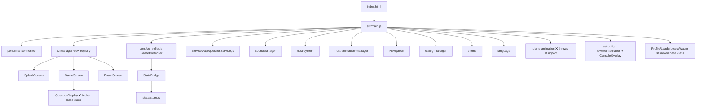

# JeoPARODY — Follow-up Review (Phases 8–12 refactor branch)

**Reviewed revision:** `4d0c439` (`mac-fixed-pushing-changes`) — 8 commits, 144 files, +23 047 / −12 061 vs `main` (`e71d0dc`).
**Method:** static read of the live import graph, `npm run lint`, `npm run lint:css`, `jest`, `vite build`, dev server + Chrome (console + axe-core 4.10.2), GitHub Actions history.
**Previous review:** `docs/AUDIT_2026.md` (audited `main`).

---

## Verdict

The refactor moved the project in the right architectural direction — one entrypoint that composes real components, a `UIManager` view registry, a `StateBridge` that finally connects the engine to the store, ESLint installed with a config, CSS collapsed into a token/layer structure. **But the branch has never been executed in a browser: `src/main.js` cannot complete `initializeApp()`, so the app is 100 % non-functional on this revision.** Five independent fatal errors fire in sequence; each one I stubbed locally revealed the next.

Nothing in this document is inferred — every failure below was reproduced at `http://localhost:3000`.

---

## The boot failure chain (all P0)

| # | Error observed in console | Cause |
|---|---|---|
| 1 | `TypeError: this.adjustBannerSize is not a function` | `src/services/plane-animation.js` calls `this.adjustBannerSize()` (lines 67, 122) — the method does not exist. The singleton is constructed at **module scope** (line 172), so the throw happens during `import`, before a single line of `main.js` runs. `window.eventBus` is never even defined. |
| 2 | `Cannot destructure property 'container' of 'object null'` | `Modal` calls `super(store, eventBus)` positionally; `ConnectedComponent` takes one options object → destructures `null`. |
| 3 | `(intermediate value).mount is not a function` | `main.js` does `new ProfileModal(eventBus).mount(document.body)`; `ConnectedComponent` has no `mount()`. |
| 4 | `Cannot set properties of undefined (setting 'innerHTML')` | `render()` writes to `this.container`, which the modal path never supplies. |
| 5 | `AppState.gameEngine.start is not a function` | `initializeCoreServices()` now builds a `GameController`, but step 9 still calls the old `GameEngine.start()` API. `GameController` exposes `startGame()`. |

With those five stubbed locally the app boots, but the gameplay surface is still dead:

- **Splash is skipped.** `renderView('splash')` runs, then the view immediately becomes `game`; the user never sees `SplashScreen`.
- **"New Question" does nothing visible.** The event chain works — the console shows `📤 Serving question (499 remaining in buffer)` — but no clue ever renders, because `QuestionDisplay` is written against a base class that doesn't exist.
- `process.env.NODE_ENV` is referenced in `main.js:113`, `main.js:157` and `performance-monitor.js:268`; `process` is `undefined` in the browser and Vite does not shim it.

### Root cause: two incompatible component contracts

`QuestionDisplay`, `GameControls`, `ScoreBoard`, `AchievementsModal` and `Modal` all rely on `mapStateToProps`, `storeState`, `setState`, `onMount` and `mount()`. `src/base/ConnectedComponent.js` implements **none** of them (it has `init/destroy/subscribe/on/emit/dispatch/getState/bindEvents/render/update/createElement`). Any component reachable from `main.js` therefore either throws or renders nothing. This is the single highest-value fix: pick one contract and make the base class satisfy it.

---

## Live architecture as it stands

Progress worth keeping: `StateBridge` genuinely dispatches engine events into the store, so the two-state-tree problem from the last review is now solvable rather than structural. Vite transforms **57 of 80** JS files (was 29 of 74) — the dead-code fraction dropped from ~60 % to ~29 %.

---

## Findings by domain

### Architecture (P0/P1)
- Base-class contract mismatch (above) — P0.
- `GameEngine` and `GameController` both exist and both own game state; `main.js` mixes their APIs. Pick one owner — P0.
- Two live question services: `src/services/api/questionService.js` (imported) and `src/services/api/question-service.js` (dead copy of the old `services/api.js`) — P1.
- `src/main copy.js` (640 lines) and `src/__DEPRECATED__/` are committed — P1.
- Naming is now split between `PascalCase.js` and `kebab-case.js` in the same directory (`host-system.js` next to `HostSystem`-era `UIManager.js`) — P2.

### Data / assets (P0)
- `assets/questions/questions.json` is still **55.5 MB** and still loaded whole: console confirms `216,930 questions` then a full shuffle. `scripts/shard-questions.js` exists, `index.json`/`shards/` still don't → `ℹ️ No index/shards found`. Also still committed: `questions.csv` (34.9 MB) and `combined_season1-40.tsv` (75.5 MB) — P0.
- **`vite build` still emits no question data.** `dist/` contains only `index.html`, favicons, `sw.js` and 6 hashed assets — no `assets/questions/**`, no host images. A deploy from this artifact cannot serve a single clue — P0.
- Host art paths are wrong: `AssetLoader` requests `assets/images/host/{alex-trebek-pixel,trebek-idle,trebek-reaction}.png` (that directory doesn't exist) and `host-animation-manager` requests `trebek-01…09`, `trebek-good-04`, `trebek-dope-04`. `assets/images/trebek/` holds 11 differently-named files. Console: `[🚀] AssetLoader finished. 0/10 loaded.` and `Host animation manager initialized with 0 images` — P0.
- `index.html:38` loads `/public/dist/js/firebase-config.js`, which doesn't exist (the dev server answers with the SPA fallback HTML) — P1.

### Performance (P0)
- Sustained **5–26 FPS** and **160 MB** heap on an idle page, entirely from the monolithic corpus plus an always-on rAF loop.
- `performance-monitor` fires an issue every second and each one throws: `TypeError: console.group is not a function` — `logger` (aliased as `console` in `main.js`) implements no `group`/`groupEnd`. So the monitor's only output is a stack trace — P1.

### Quality gates (P0)
- `npm run lint` now runs (ESLint 8 + `.eslintrc.cjs` — good) but reports **70 errors**: 37 `no-unused-vars`, 10 `no-undef` (incl. the `process` refs), 8 `no-empty`, 6 `no-useless-escape`, 5 `no-case-declarations`, 3 `no-prototype-builtins`, 1 `no-duplicate-case`.
- `npm run lint:css` reports **592 errors** (was 151) — the CSS consolidation quadrupled the debt; 493 are `--fix`-able.
- `jest`: 40 tests pass, but **1 suite fails** (`tests/test-fixes.html`-era suite with no tests) and the passing tests still cover `core/scoring`, `core/validation`, `services/ai` — i.e. the *unwired* modules. Zero tests touch `main.js`, `UIManager`, `GameController` or any component. A single smoke test asserting `window.JeopardyApp.initialized === true` would have caught all five fatal errors — P0.
- CI is unchanged and has **never run on this branch** (last CI run: 2025-10-10, failure). `eslint` is in `dependencies`, not `devDependencies` — P1.
- The axe step is still `--exit 0 … || true` against `dist/index.html` instead of a served URL, so a11y can never fail the build — P1.

### Accessibility (P1) — regressed
axe-core on the booting app: `serious aria-hidden-focus` (1), `serious color-contrast` (6), `critical label` (1), `critical meta-viewport` (1, `user-scalable=0`), `moderate page-has-heading-one`, `moderate region` (3). The two criticals are unchanged from the last review; contrast and `aria-hidden-focus` are new — the offscreen side menu keeps focusable buttons inside an `aria-hidden` subtree.

### Security (P1)
- `injectKeysFromURL()` still persists `?gemini_key=`/`?key=` into `localStorage` (and the comment now says the rest of the logic was "simplified for brevity"). Keys still travel from the browser; the `/api/gemini` proxy the code prefers still doesn't exist.
- Three Firebase compat scripts and `chart.js` load from CDNs with no SRI and no CSP; Chart.js is still unused.

### UX / product (P1)
- Splash never shows; there is no visible route into fullboard, run-the-category, practice, daily-double or PAO from the rendered UI.
- `GameScreen` binds `#questionButton`/`#answerButton` in `_bindEvents()` **and** `main.js:setupGameControls()` binds the same IDs — double emits, double click sounds.
- `main.js` still writes answers with `answerBox.innerHTML = question.data.answer`.
- `scripts/scan-todos.js` (a nice addition) reports **52** in-code TODO/placeholder findings, including `index.html:71` shipping the ticker text "Jeopardish UI now 100% bug-free!".

### Docs (P2)
48 markdown files under `docs/`, with `ACTIVE_TASKS.md`, `CARMACK_*`, `MASTER_PLAN.md`, `PROJECT_MASTER_PLAN.md`, `CSS_CHANGES_LOG.md` etc. duplicated verbatim between `docs/` and `docs/archive/2025-11-02-pre-consolidation/`. The numbered `docs/01_SETUP.md`…`05_ROADMAP.md` set is the right idea — make it the only entrypoint.

---

## Recommended order of work

**P0 — make it run (a day's work, unblocks everything else)**
1. Add the missing `adjustBannerSize()` (or drop the call) and stop constructing `PlaneAnimationService` at module scope — export a factory the app initialises explicitly.
2. Reconcile `ConnectedComponent` with the contract its subclasses use (`mount`, `setState`, `storeState`, `mapStateToProps`, `onMount`).
3. Fix `Modal`'s `super(...)` call.
4. Replace `AppState.gameEngine.start()` with `GameController.startGame()` and delete whichever engine you aren't keeping.
5. Remove all `process.env` references from browser code (use `import.meta.env`).
6. Render `SplashScreen` first and don't auto-advance.
7. Make `vite build` copy `assets/**`; ship the generated question shards; fix the host-image paths.
8. Add a Playwright/Vitest smoke test — boot the app, assert `initialized === true` and that a clue renders after "New Question" — and run it in CI.

**P1** — clear the 70 ESLint and 592 stylelint errors and make CI blocking; give `logger` `group`/`groupEnd`; delete `main copy.js`, `__DEPRECATED__/`, and the duplicate question service; drop URL key injection and add a real proxy; fix `aria-hidden-focus`, the unlabelled input, `user-scalable`, and contrast; de-duplicate the game-control bindings; move `eslint` to devDependencies.

**P2** — purge the three multi-MB data files from git history; collapse the 48 docs into the numbered set; add SRI/CSP; remove Chart.js; work through the 52 TODO findings.
