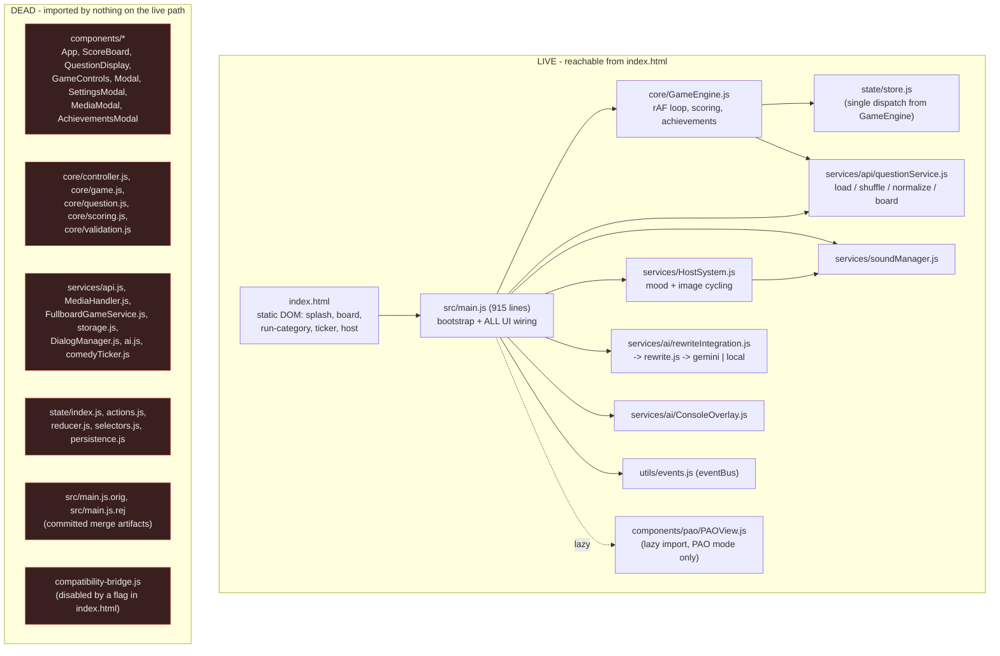
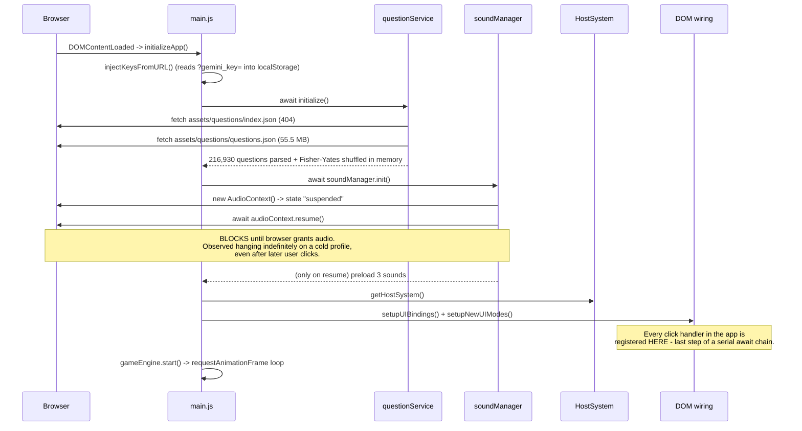
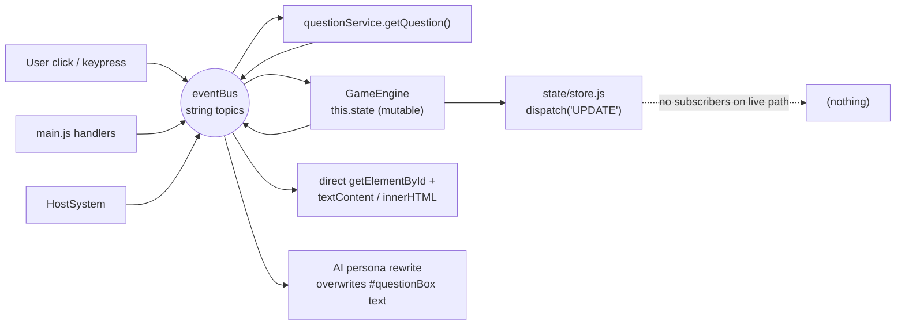
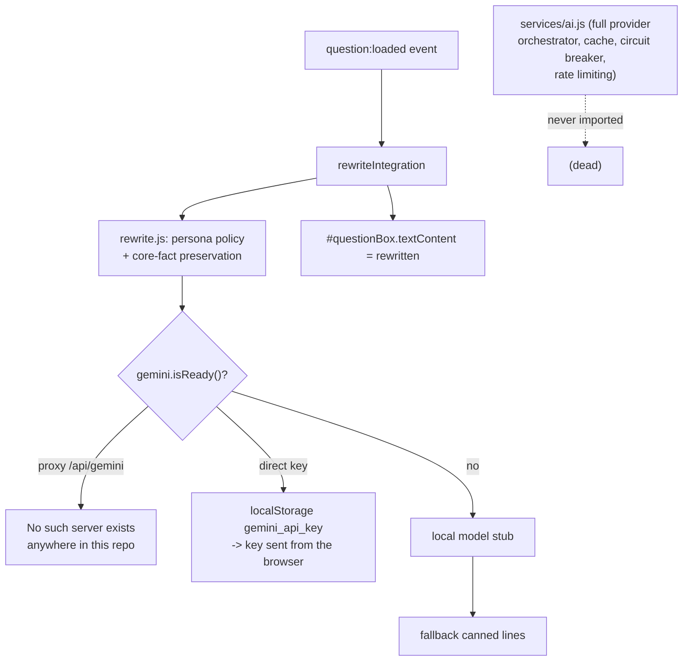

# jeoPARODY — Full Application Audit

Audit of `main` @ `e71d0dc`. Methodology: static reading of every source module, dependency-graph analysis (what the entry point actually reaches), a build + test + lint run, and live runtime inspection of both the local dev server and the deployed GitHub Pages site (console traces, DOM, axe-core scan).

Verdict up front: **the documented architecture and the running application are two different programs.** More than half of `src/` is never loaded by the entry point, the primary game mode ("Start Classic") has no UI to render into, and the boot sequence can deadlock before any event handler is attached. The good news: the underlying pieces (question corpus, host system, board renderer, PAO trainer, design tokens) are individually decent — the work needed is consolidation, not a rewrite.

---

## 1. How it works today

### 1.1 What actually loads

`index.html` loads exactly one module: `src/main.js`. Everything reachable from that import graph is live; everything else still ships in the repo, is linted, and is maintained — but never runs.

Only 29 modules are transformed by `vite build`, out of 74 JS files in `src/`.

### 1.2 Boot sequence (and where it stalls)

Consequence: any hang or slow step before `setupUIBindings()` leaves a fully rendered but completely inert page — the splash buttons look enabled and do nothing. This was reproduced on a cold browser profile against the dev server (screenshot: splash visible, `JeopardyApp.initialized === false`, console stops after "Question service ready"). Forcing `resume()` to time out made the whole app come alive immediately, confirming the cause.

### 1.3 Runtime data flow

There are **three parallel sources of truth**: `GameEngine.state` (mutable object, authoritative), `state/store.js` (written once, read by nobody), and the DOM itself (`answerBox.classList.contains('visible')` is read as game state in `main.js`). Scoreboard updates are done by `document.getElementById('score').textContent = ...` inside a service-integration callback.

### 1.4 Game modes

| Mode | Wired? | State |
|---|---|---|
| Start Classic | partially | **Broken.** `main.js` renders clues into `#categoryBox`, `#questionBox`, `#answerBox`, `#inputBox`, `#checkButton` — **none of these IDs exist in `index.html`.** Clicking "Start Classic" hides the splash and shows an empty background. |
| Full Jeopardy Board | yes | Works. 6x5 board renders from real clues; date/year/month filter works. But clicking a clue only shows the clue text in a modal — no answer entry, no scoring, no "used" state, no Escape-to-close. |
| Run the Category | skeleton | Static placeholder rows; clicking any row just advances a fake progress bar by 20%. |
| Practice / Daily Double | no | Buttons emit `game:start` with a mode string nothing consumes. Splash hides, nothing appears. |
| PAO Trainer | yes | Self-contained module, works, keeps its own state in localStorage. Architecturally the cleanest part of the codebase. |

### 1.5 AI subsystem

The sophisticated provider orchestration in `services/ai.js` — caching, per-provider backoff, circuit breaking, rate limiting — is dead code. The live path is the much simpler `rewriteIntegration`, which writes into `#questionBox` (an element that does not exist).

---

## 2. Expert reviews

Each section is written from the perspective of a specialist in that domain, and ends with concrete recommendations. Severity: **P0** = broken/unsafe in production, **P1** = significant, **P2** = quality/polish.

### 2.1 Software architecture

**Assessment.** The repo documents a clean layered design (components / core / state / services / utils) and the modules for it exist and are individually reasonable. But nothing wired them together: `main.js` re-implements the whole application as a 915-line procedural script that talks straight to the DOM. The result is two complete implementations of nearly everything — two game engines (`core/GameEngine.js` and `core/game.js` + `core/controller.js`), two question services (`services/api/questionService.js` and `services/api.js`), two state models (`GameEngine.state` and `state/reducer.js`), two answer validators (`GameEngine.checkAnswer` and `core/validation.js`), two component trees (`components/*` and raw DOM in `index.html`). In each pair the *worse* one is live and the *better* one is dead.

The event bus is used as a global message bus with untyped string topics and no schema; `main.js` registers `question:show-answer` twice with different bodies (lines ~197 and ~432), so revealing an answer runs two handlers that fight over the same element (one sets `innerHTML`, the other `textContent` + `style.display`).

**Recommendations**
- **P0 — Pick one implementation per concern and delete the other.** Decide: keep `main.js` as the app and delete `components/`, `core/controller.js`, `core/game.js`, `state/*` — or (preferred) adopt the component/store layer and reduce `main.js` to a ~40-line bootstrap. Do not keep both.
- **P0 — Delete `src/main.js.orig` and `src/main.js.rej`.** Committed merge artifacts are actively misleading; `main.js.orig` still imports live modules and reads as a plausible alternative entry point.
- **P1 — Single source of truth for game state.** Never read game state out of the DOM (`answerBox.classList.contains('visible')`). Either the store or `GameEngine.state`, not both plus the DOM.
- **P1 — Type the event bus.** Centralise topic names in `utils/events.js` as constants with documented payload shapes; forbid raw string topics. Today `GAME_EVENTS.ANSWER_SUBMITTED` and the literal `'answer:submit'` are both emitted for the same user action.
- **P1 — Split `main.js`** into `bootstrap.js` (init order), `wiring/*.js` (per-screen handlers), and keep rendering in components.
- **P2 — One module = one export style.** `questionService.js` exports 12 named functions *and* a default object with a different subset; `GameEngine` exports a class, a factory, a config object and a phases enum. Pick one convention.

### 2.2 Frontend / UI engineering

**Assessment.** The visual design is genuinely charming — the retro board, the pixel-art title, the plane ticker, the palm trees, the neon/arcade button variants. It is undermined by the implementation. Markup is duplicated: `#scoreboard` with the same four `
` rows is defined both in `index.html` and again in `components/App.js` (duplicate DOM IDs if both ever render). Inline styles are injected from JS (`attachBoardControls` builds a date picker with hardcoded `#ffd700` inline styles, bypassing the token system entirely). `innerHTML` is used 39 times across `src/`, including in `main.js` for the board controls and in the fatal-error handler.

CSS: 8 stylesheets plus a 1,918-line `assets/css/styles-complete.css` that is referenced only from a comment and a stale audit doc. 69 `!important` declarations and 43 hand-managed `z-index` values, partially organised by a `@layer` cascade in `app.css` — the layers are the right idea, the `!important`s defeat them. `npm run lint:css` reports **151 errors**.

**Recommendations**
- **P0 — Add the missing classic-mode markup** (`#categoryBox`, `#valueBox`, `#questionBox`, `#answerBox`, `#inputBox`, `#checkButton`, `#questionButton`, `#answerButton`) or, better, render that screen from `components/QuestionDisplay.js` + `GameControls.js`, which already implement it.
- **P0 — De-duplicate `#scoreboard`.** One owner for every DOM id; add a dev-time assertion that no id is defined twice.
- **P1 — Delete `assets/css/styles-complete.css`** (40 KB, unreferenced) and fix the 151 stylelint errors so CI can enforce style going forward.
- **P1 — Eliminate `!important` and hand-rolled z-indexes** in favour of the existing `@layer` + `--z-*` token scale. Move the inline styles in `attachBoardControls` into `ux-pack.css`.
- **P1 — Replace `innerHTML` with `textContent`/DOM construction** anywhere a value can come from question data or user input (see Security).
- **P2 — The theme system has three overlapping mechanisms**: `.dark-theme`/`.dark-mode` classes on both `<html>` and `<body>`, `data-theme-mode`, and `data-theme` variants. Collapse to a single `data-theme` attribute.
- **P2 — Font loading.** Seven Google Font families plus Font Awesome plus Chart.js are loaded from three CDNs on every page load; Chart.js is never used. Drop it, self-host the two fonts actually used.

### 2.3 UX / product design

**Assessment.** The splash promises six modes; two work, one is a placeholder, three do nothing. From the player's point of view the app fails silently: no loading state during the multi-second question load, no error state, no feedback when a mode isn't implemented. The full-board mode — the most impressive screen — is a dead end: you can open a clue but not answer it, the clue stays available after you read it, and the only way out is clicking outside the card (Escape does nothing). Clue values are approximated by nearest-match bucketing, so a `$200` cell can hold a clue that originally aired at `$1000`.

Scoring is invisible in practice: the scoreboard lives inside the ticker plane graphic and is only flashed for 2.5 s after an answer is evaluated — in a mode that can't evaluate answers.

**Recommendations**
- **P0 — Never leave a mode button inert.** Wire every splash button to either a real screen or an explicit "coming soon" state.
- **P0 — Make the board mode a game**: answer input in the clue modal, correct/incorrect feedback, score delta, mark the cell as used, and end-of-board summary. This is the shortest path from "demo" to "product".
- **P1 — Loading and error states.** A 55 MB fetch with no spinner reads as a broken page. Show progress; show a retry on failure instead of silently serving "TECHNICAL DIFFICULTIES" joke clues.
- **P1 — Honour the Jeopardy answer format.** The corpus answers are bare ("Paris"), the parody premise is the question format ("What is Paris?"). Validation strips it entirely — decide whether to require, reward, or ignore it, and tell the player which.
- **P1 — Surface the score persistently** rather than a 2.5 s flash inside a decorative aeroplane.
- **P2 — Keyboard shortcuts (`n`, `s`, `m`) are undocumented** in the UI and inactive while an input is focused; add a help overlay listing them.
- **P2 — The ticker copy** ("Jeopardish UI now 100% bug-free") is placeholder text shipped to production.

### 2.4 Accessibility

**Assessment.** An axe-core scan of the splash screen returns 3 violation types, 2 of them critical:

| Impact | Rule | Detail |
|---|---|---|
| critical | `meta-viewport` | `maximum-scale=1.0, user-scalable=0` blocks pinch-zoom — a WCAG 1.4.4 failure |
| critical | `label` | the dark-mode checkbox has no accessible name |
| moderate | `region` | 7 regions of content outside any landmark |

Beyond the automated scan: the clue modal declares `role="dialog" aria-modal="true"` but `aria-hidden` is never toggled, focus is never moved into it, there is no focus trap and no Escape handler — a screen-reader user cannot tell it opened, and a keyboard user cannot close it. Board clues are `
`s with no `role`, `tabindex`, or key handlers, so the entire board is mouse-only. There are no `aria-live` regions, so score changes and host reactions are announced to nobody. Excellent focus-trap code already exists in `components/App.js` — on the dead path.

**Recommendations**
- **P0 — Remove `maximum-scale=1.0, user-scalable=0`** from the viewport meta.
- **P0 — Make the board keyboard-operable**: clues become `<button>`s (or get `role="button"` + `tabindex="0"` + Enter/Space handlers).
- **P0 — Real modal semantics**: toggle `aria-hidden`, move focus in on open, trap Tab, close on Escape, restore focus on close. Reuse the implementation already in `App.js`.
- **P1 — Label every control**; add `aria-live="polite"` to the score and host-dialog regions.
- **P1 — Wrap content in landmarks** (`<header>`, `<main>`, `<nav>`).
- **P1 — Fix the axe step in CI**: it currently runs `axe dist/index.html` (a file path, not a served URL) with `--exit 0`, so it can never fail and probably never audited anything. Serve `dist` and let the job fail on new critical violations.
- **P2 — `prefers-reduced-motion`** is not honoured anywhere despite continuous ticker, plane, and host animations.

### 2.5 Performance

**Assessment.** Measured, not theorised:

- `assets/questions/questions.json` is **55.5 MB** and is fetched in full on every page load, on the live site too. It parses to 216,930 objects, all retained in memory, then gets a full Fisher-Yates shuffle — the whole corpus is sorted so 500 clues can be used.
- The live site logs **20–29 FPS** continuously (`[GameEngine] Low FPS detected`), from a `requestAnimationFrame` loop that runs forever even in the menu, plus always-on CSS animations.
- The rAF loop calls `update()` every frame but only does work in three phases; in every other phase it's a pure waste of a frame callback.
- `getNextLocalQuestion()` uses `Array.prototype.shift()` on the buffer (O(n) per call) and, when the buffer runs low, `slice`s a fresh 500-element window out of the 217k array and shuffles it again.
- The repo itself is a 104 MB pack (159 MB of question files in git history), making clones painfully slow.
- A dev-only `setInterval` performance logger runs every 10 s and is gated on `location.hostname === 'localhost'` — but also on `?debug=true`, so any visitor can turn it on.

`scripts/shard-questions.js` already exists and `questionService` already prefers `assets/questions/index.json` + `shards/<year>.json` — the sharding was designed but the shards were never generated or committed.

**Recommendations**
- **P0 — Generate and ship the shards.** Run `scripts/shard-questions.js` in the build, commit/publish `index.json` + per-year shards, and drop the monolithic JSON from the deployed site. Expected first-load payload: tens of KB instead of 55 MB.
- **P0 — Stop the rAF loop when idle.** Start it on `question` phase, stop on `menu`/`result`. Nothing needs 60 Hz on a static menu.
- **P1 — Don't shuffle the corpus.** Sample k random indices instead of shuffling 217k elements; replace `shift()` with an index cursor.
- **P1 — Purge the large data files from git history** (BFG or `git filter-repo`) and serve the corpus from a CDN/release asset. Clone time and CI install time both drop dramatically.
- **P1 — Audit the animation budget.** Continuous transforms on the ticker/plane/palms are the likely cause of the sub-30 FPS baseline; use `will-change` sparingly, prefer transform/opacity, pause offscreen animations.
- **P2 — Remove the unused Chart.js CDN script** and the always-on perf `setInterval`.

### 2.6 Data & content pipeline

**Assessment.** Three formats of the same corpus are committed (`questions.json` 55 MB, `combined_season1-40.tsv`, `questions.csv`) with no documented canonical source and no schema. `questionService` tries seven fallback paths in sequence, four of which (`questions/`, `src/questions/`, `public/questions/`, `./questions/`) point at directories that do not exist — every cold load makes four guaranteed-404 requests plus one for the missing shard index.

The CSV/TSV parsers are `line.split(',')` / `split('\t')` with no quote handling, so any clue containing a comma silently corrupts every field after it. `normalizeQuestionData` invents data when fields are missing: `airdate` defaults to *today's date*, `difficulty` to `'Medium'`, `contestant`/`season`/`episode` to `'Unknown'` — a synthetic airdate then feeds the date-filter feature, so filtering by "today" returns junk. There is no validation that a question has both a clue and an answer, and no dedupe (the corpus spans seasons 1–40 and Jeopardy reuses clues).

**Recommendations**
- **P1 — Declare one canonical source format** (newline-delimited JSON or the sharded JSON) and delete the others; document the schema in `DATA.md` alongside the provenance and licensing of the clue data.
- **P1 — Validate at ingest, not at render.** A build-time script should reject rows missing clue/answer/category, normalise values, dedupe, and emit shards. Then the runtime parser can be deleted entirely.
- **P1 — Never fabricate `airdate`.** Leave it null and have the date filter exclude unknowns.
- **P1 — Remove the four non-existent fallback paths.**
- **P2 — Media clues.** The corpus contains clues that reference images/audio from the broadcast; `MediaHandler`/`MediaModal` exist for this but are on the dead path, so those clues currently render as text referring to media the player can't see.
- **P2 — Content safety.** A 217k-clue corpus from 40 years of television will contain dated and offensive material; there is no filter or reporting path. For a product aimed at classrooms this is a launch blocker.

### 2.7 Security

**Assessment.** No secrets are committed (good). The real issues are in the AI key handling and DOM injection:

- **API keys live in `localStorage` and are sent directly from the browser.** `injectKeysFromURL()` reads `?gemini_key=` / `?claude_key=` / `?key=` from the URL and persists them. Keys therefore land in browser history, in any referrer, and in server logs of whatever served the link. Any XSS on the page exfiltrates them, and the key is usable by anyone who reads it — Gemini keys are not scopeable to a domain.
- **The proxy the code prefers does not exist.** `gemini.js` defaults to `useProxy: true` against `/api/gemini`, but there is no server in this repo and Pages can't host one, so the documented "secure" path is unimplemented; the only working path is the insecure one.
- **`innerHTML` with question data.** `main.js` sets `answerBox.innerHTML = question.data.answer` from corpus data; `attachBoardControls` builds markup by string concatenation. The board renderer was already hardened to use `textContent` — apply that consistently.
- No CSP, no SRI on the six third-party CDN includes (`cdnjs`, `jsdelivr`, two Google Fonts hosts, gstatic). A compromise of any of them is script execution on the page.
- `sw.js` exists in `public/` but is never registered — dead, and a stale service worker file is a footgun if it ever is.

**Recommendations**
- **P0 — Remove URL-parameter key injection**, or gate it behind an explicit dev build flag that is stripped in production.
- **P0 — Stand up the Gemini proxy** (a serverless function is enough) and make the direct-key path opt-in and clearly labelled "your key is used from your browser". Without a proxy, ship with AI off by default.
- **P1 — Add a Content-Security-Policy** meta/header and SRI hashes for CDN scripts; better, self-host them.
- **P1 — No `innerHTML` for any corpus- or user-derived string.**
- **P2 — Delete `public/sw.js`** or register it deliberately with a versioned cache strategy.
- **P2 — Add a LICENSE file.** The README says "MIT ... or treat this repository as MIT-licensed by default", which is not a licence grant.

### 2.8 Game logic correctness

**Assessment.** Reading the two engines side by side surfaces real bugs:

- `GameEngine.calculateSimilarity` builds a full Levenshtein matrix and accepts ≥ 0.8 similarity. Because the threshold is on the *whole string*, short answers behave badly: "Paris" vs "Parid" passes (0.8), and so does any 1-character error on a 5-letter answer — while "William Shakespeare" vs "Shakespeare" fails (0.58) despite being the answer a human judge accepts. The dead `core/validation.js` handles articles, alternates, and partial credit far better.
- **The clue's own dollar value is ignored.** Scoring is `BASE_POINTS(100) × difficulty + time bonus + streak bonus`, so a $1000 clue is worth the same as a $200 one. The corpus value is normalised, stored, displayed — then discarded.
- `controller.startCategoryMode()` calls `getQuestionsByCategory(category)` with the *object* `{name, questionCount}` returned by `getRandomCategory()`, while that function compares against a string — it can only ever return `[]`. (Dead path, but the bug would ship the moment category mode is wired up.)
- The 30-second timer runs off accumulated `deltaTime` in the rAF loop, so it pauses when the tab is backgrounded and drifts under frame drops (currently ~28 FPS). Use wall-clock time.
- `updateScore` treats `scoreData.total > 0` as "was correct", so a correct answer submitted after the time bonus and streak bonus are zero would still be correct — but a correct answer worth 0 points would break the streak.
- `stats.achievements` is a `Set`, which `JSON.stringify` serialises as `{}` — achievements silently fail to persist through the store.

**Recommendations**
- **P0 — Score from the clue's actual value.** `value × difficulty` with the time/streak bonuses layered on top.
- **P1 — Adopt `core/validation.js`** (or port its article/alternate/partial-credit handling into the live engine) and make the threshold length-aware: exact match for short answers, token-overlap for multi-word ones.
- **P1 — Wall-clock timer**, paused explicitly on `visibilitychange`.
- **P1 — Serialise achievements as an array**; add a persistence round-trip test.
- **P2 — Fix the `getQuestionsByCategory` argument mismatch** before category mode ships.

### 2.9 Testing

**Assessment.** 40 tests pass in ~1 s. All of them test dead code: `tests/core/scoring.test.js` and `tests/core/validation.test.js` cover `core/scoring.js` and `core/validation.js`, neither of which the application loads. `tests/services/ai.mock.test.js` tests `services/ai.js` — also dead. So the suite is green while the app's primary mode is broken. There are no tests for `GameEngine`, `questionService`, `main.js` wiring, or any DOM behaviour, and no end-to-end tests at all (`scripts/playwright-sample.mjs` exists but Playwright isn't a dependency and nothing runs it). `npm test` passes `--passWithNoTests`, so an empty suite is also "green".

**Recommendations**
- **P0 — One end-to-end smoke test** that loads the page, waits for init, clicks each splash mode, and asserts something rendered. That single test would have caught every P0 in this report.
- **P1 — Unit-test what actually runs**: `GameEngine` scoring/streak/timeout transitions, `questionService.normalizeQuestionData` and `getRandomBoard`, and answer validation.
- **P1 — Test the boot sequence** with a suspended AudioContext to lock in the deadlock fix.
- **P2 — Drop `--passWithNoTests`** and add a coverage floor once tests cover live code.

### 2.10 Build, CI/CD & deployment

**Assessment.** This is the most urgent area after the boot bug.

- **CI has been failing on `main` since at least 2025-10-09** — every recent `CI` run is red. The `lint` step runs `eslint`, which **is not a dependency and is not installed** (`sh: 1: eslint: not found`, and there is no eslint config file at all), and `lint:css` reports 151 errors. So neither lint gate has ever actually gated anything.
- **The built site is not what's deployed.** The `Deploy Pages` workflow uploads `dist/`, but the live site at `alexbaldman.github.io/jeoPARODY/` serves the *raw repository* — unbundled `src/main.js`, `src/styles/app.css`, and the full 55 MB `questions.json`. A second, legacy `pages-build-deployment` job runs on the same pushes and wins. Two deployment mechanisms are racing.
- **`assets/` never reaches `dist/`.** It is not in `public/` and not imported, so `vite build` produces a 596 KB `dist` with no questions, no host images and no audio. Were the Actions deployment to win the race, the site would be *more* broken, not less. Only the host images that are imported by the bundler survive.
- `base: './'` plus `assets/...` relative fetches happen to work at the Pages sub-path only because the raw repo layout is being served.
- No preview deployments, no bundle-size budget, no Dependabot/audit step.

**Recommendations**
- **P0 — Fix CI**: add `eslint` + a config as devDependencies (or drop the lint script), run `stylelint --fix` and fix the remainder, and get `main` green. A permanently red CI trains everyone to ignore it.
- **P0 — Pick one deployment path.** Disable the legacy branch-based Pages build and deploy only the Actions artifact — after fixing the asset problem, since today that would take the site down.
- **P0 — Make `vite build` produce a complete site**: move `assets/` under `public/` (or add `vite-plugin-static-copy`), with the sharded question data replacing the monolith.
- **P1 — Add a bundle/asset size budget** to CI that fails on a multi-megabyte payload.
- **P1 — Add `npm audit` / Dependabot** and pin the Node version with `.nvmrc` + `engines`.
- **P2 — Remove Windows-only scripts** (`chrome:rdp` shells out to PowerShell) or document them as Windows-only; they break on the CI/dev platform.

### 2.11 Documentation & repo hygiene

**Assessment.** There is a lot of documentation and most of it describes intentions rather than reality: `ARCHITECTURE.md`, `README.md`, `WARP.md`, `Gemini.md`, `UI_GUIDE.md`, `DATA.md`, `CONTRIBUTING.md`, and seven files in `docs/` (including two overlapping CSS refactor plans and a CSS audit that references a stylesheet no longer in use). The README's architecture section describes the component/store design that is dead code, and its state-shape example matches neither `state/reducer.js` nor `GameEngine.state`. `package.json` still calls the project `jeopardish` at version 2.1.0 while the product is `jeoPARODY`. Committed `.orig`/`.rej` merge artifacts and a root-level `test-media-rendering.html` scratch file add to the noise.

**Recommendations**
- **P1 — Make `ARCHITECTURE.md` describe what runs**, with the "as-is" diagram above and a separate clearly-labelled "target" diagram.
- **P1 — Consolidate the docs**: one architecture doc, one contributor guide, one data doc; archive the rest under `docs/history/`.
- **P2 — Remove scratch files and merge artifacts**; align the package name/version with the product.
- **P2 — Add pre-commit hooks** (lint + stylelint on changed files) once lint is green, so CI stays green.

---

## 3. Prioritised plan

### P0 — do first (the app is broken without these)

| # | Fix | Area |
|---|---|---|
| 1 | Don't `await AudioContext.resume()` during boot — initialise audio lazily on first user gesture, and wire UI handlers **before** any awaits | Boot |
| 2 | Add the classic-mode markup (or render `QuestionDisplay`/`GameControls`) so "Start Classic" is playable | UI |
| 3 | Ship sharded question data; stop serving 55 MB per visit | Performance |
| 4 | Make `vite build` emit a complete site (assets included) and deploy exactly one way | Deployment |
| 5 | Get CI green: install/configure eslint, fix stylelint errors | CI |
| 6 | Remove URL-parameter API-key injection | Security |
| 7 | Score clues by their actual dollar value | Game logic |
| 8 | Board mode: answer input, scoring, used-cell state, Escape to close | UX |
| 9 | Keyboard-operable board + real modal semantics; remove `user-scalable=0` | Accessibility |
| 10 | One E2E smoke test covering every splash mode | Testing |
| 11 | Delete `main.js.orig` / `main.js.rej` | Hygiene |

### P1 — next (structural)

Choose one architecture and delete the other half (§2.1) · single source of truth for state · adopt `core/validation.js` for answer checking · wall-clock timer · stop the rAF loop when idle · validate/dedupe corpus at build time · Gemini proxy + CSP/SRI · unit tests for live modules · purge large blobs from git history · rewrite `ARCHITECTURE.md` to match reality.

### P2 — polish

CSS consolidation and `!important` removal · single theme mechanism · self-host fonts, drop unused Chart.js · `prefers-reduced-motion` · media clues via `MediaHandler` · content-safety filter for a 40-year corpus · LICENSE file · docs consolidation · pre-commit hooks.

---

## 4. Where the leverage is

Three observations worth more than the individual line items:

1. **The best code in this repo is the code that doesn't run.** `core/validation.js`, `core/scoring.js`, `components/*`, `state/*` and `services/ai.js` are better than their live counterparts. The highest-value work isn't writing new code — it's connecting what already exists and deleting the duplicate.

2. **A single end-to-end smoke test would have caught almost every P0.** The suite is green, the build succeeds, and the app doesn't start. Nothing in the pipeline ever loads the page.

3. **The data layer decides the product's ceiling.** A 55 MB client-side corpus rules out mobile, classrooms, and anything multiplayer. Sharding (already designed, never wired up) unlocks fast loads, category/date curation, difficulty tuning, and eventually a server-side content service for UGC decks.
