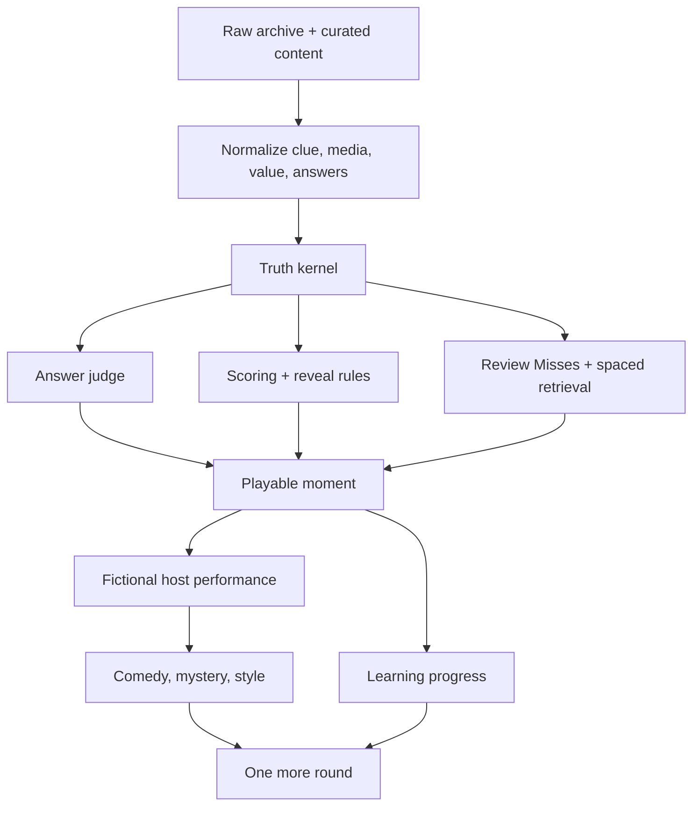

# Carmack Convergence Review

Status: Active critique layer  
Prepared: 2026-06-03  
Purpose: Keep JeoPARODY honest, fast, funny, and educational while converging the best work from Jeopardish and JeoPARODY.

This is not an endorsement by John Carmack. It is an explicit engineering-review lens inspired by the user's request: assume a brutally curious technical cofounder has fallen in love with the project, read the whole thing, and now wants the machine tuned until it is hilarious, legible, fast, and hard to break.

## One-Sentence Verdict

The product has the right strange spark, but the next win is not more spectacle; it is making the playable truth loop so crisp that the spectacle has something trustworthy to orbit.

## The Real Product

JeoPARODY should become:

> A fast retro comedy-learning game where verified trivia facts are transformed into theatrical game-show moments by an unreliable fictional host, while the answer judge, scoring rules, and learning record remain boringly correct.

That contrast is the engine:

- The show may lie.
- The host may squirm.
- The currency may be fake.
- The rules, facts, answer validation, and learning history must not wobble.

## What The Project Already Has

### JeoPARODY

- Vite build system.
- Modular `src/` architecture.
- `GameEngine`, canonical scoring, validation, services, AI provider/fallback structure.
- Layered CSS and tokens.
- Jest tests, JS lint, CSS lint, and build currently passing.
- Runtime smoke script that exposes real browser failures.
- Active production remediation plan.

### Jeopardish

- Small dependency-free static MVP.
- Review Misses loop.
- Starter pack and generated shards.
- Stable clue-id shard lookup.
- Tested answer matching and session scoring.
- Clear `view.js` / `game-session.js` / `question-bank.js` separation.
- Local host ticker and quip tone.
- Passing `npm run verify`.

### Vision Work

- Strong arcade/pirate-broadcast/celestial-theatre energy.
- Counterfeit tender / questionable bill gag.
- Fictional host direction.
- Media clue modal ideas.
- Mermaid/story-diagram instinct for explaining the system visually.

## Current Hard Truths

1. JeoPARODY is the canonical product, but it still has runtime gates to repair.
2. Jeopardish has working learning/data features that are too valuable to lose.
3. Build success is not enough; production preview must load playable content.
4. `dist/` currently does not show the question assets needed for a public static deployment.
5. Runtime smoke against preview currently fails at full-board activation.
6. The repo has many dirty changes and local-only commits; preservation comes before surgery.
7. The game will fail as a product if it becomes a visual toy without a durable learning loop.
8. The game will fail as comedy if the host is just random jokes instead of a system reacting to play.

## Carmack Rules For This Project

1. **The core loop must be obvious.**  
   Load clue, answer, judge, score, learn, continue. Every feature should make that better or wait.

2. **The fast path must be local.**  
   AI, audio, cloud saves, and generated art cannot be required for first play.

3. **Data beats decoration.**  
   Normalize clues, answer candidates, media, values, source metadata, and review ids before building bigger modes.

4. **One owner per behavior.**  
   Question selection, reveal state, scoring, and review queue updates must each have one authoritative owner.

5. **Comedy is timing plus consequence.**  
   Quips should respond to game state: empty answer, typo accepted, wrong answer, reveal, streak, wager, media clue, finale.

6. **Never hide uncertainty with vibes.**  
   If a clue has weird value semantics, missing media, unsafe markup, or ambiguous answer candidates, the system records that.

7. **Prototypes are sacred evidence, not architecture.**  
   Jeopardish proves ideas. JeoPARODY absorbs them only through clean, tested implementation.

## The Finely Tuned Machine

## Product Refinement Priorities

### 1. Stabilize The Runtime

Do this before new feature expansion:

- Preserve current branches and dirty states.
- Fix production asset packaging for questions/index/shards.
- Make runtime smoke pass in preview.
- Confirm a cold load enters playable classic mode without AI/audio.
- Hide or mark incomplete modes until their loops are real.

### 2. Lock The Truth Kernel

Create or enforce a normalized content model:

- stable clue id
- category
- original clue text
- canonical answer
- accepted answers
- value display
- value semantics
- round/type
- media items
- source/provenance
- quality flags

The truth kernel is what lets the rest of the game become ridiculous safely.

### 3. Migrate Learning From Jeopardish

First real learning feature:

- missed clue queue
- revealed clue queue
- deterministic recovery by clue id
- local-only persistence
- simple review mode
- visible accuracy/streak/session summary

This should ship before AI explanations or social competition.

### 4. Make Answer Feedback Humane

Answer validation should expose why:

- exact
- normalized
- alternate accepted
- fuzzy typo accepted
- plural/alias accepted
- near miss but rejected
- too vague
- wrong
- empty
- revealed/no credit

This is where educational trust is earned.

### 5. Build Host As A State System

The host needs state, not just lines:

- polite broadcaster
- amused judge
- defensive liar
- exposed counterfeit host
- finale mode

Each state changes quips, visual expression, transition copy, and maybe allowed story artifacts. The player should feel the host noticing them.

### 6. Turn Weird Money Into System Design

Do not treat all dollar values equally.

- Normal clue values render as ordinary game stakes.
- Daily Double wagers render as suspect or special tender.
- Final/null values render as wager/finale state, not `$100`.
- Impossible values become part data-semantics, part joke.

The gag works best when the engine understands the truth behind it.

### 7. Expand Modes Only After Gates

Classic mode first. Then:

- Review Misses
- Daily Board
- Category Runs
- PAO / memory tools
- AI host/explanations
- multiplayer/social

Every mode must reuse the same truth, scoring, answer, and review systems.

## Comedy Machine Notes

The humor should come from specificity, restraint, and game-state consequence.

Strong recurring bits:

- `QUESTIONABLE TENDER`
- forged broadcast paperwork
- host apologizing in a way that makes things worse
- fake Canadian institutions
- wrong moustache evidence
- categories that accidentally testify against the host
- network memos that are legally meaningless but emotionally incriminating

Avoid:

- random one-liners detached from play
- jokes that slow down the answer loop
- real-person illness/conspiracy framing as factual product lore
- host cruelty toward genuine learning failure

## Immediate Implementation Queue

1. Create preservation branches/commits for JeoPARODY and Jeopardish WIP.
2. Fix JeoPARODY preview runtime smoke failure.
3. Package production question assets into `dist` intentionally.
4. Confirm reveal/no-credit scoring in JeoPARODY with tests.
5. Migrate Review Misses from Jeopardish.
6. Add answer-result reason UI.
7. Add host ticker as local deterministic fallback.
8. Start original identity/provenance pass only after the game loop is stable.

## The Cofounder Challenge

The question to ask before any change:

> Does this make the player answer another clue, trust the result more, learn better, or laugh at exactly the right moment?

If not, park it.

The dream is big enough. The machine needs tuning.

