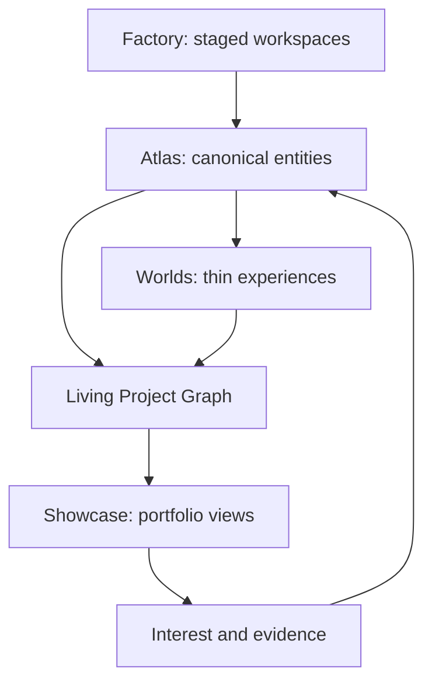

# uINVERSE architecture proof

One job: separate durable knowledge, repeatable transformations, audience experiences, and derived promotion so each can evolve without impersonating the others.

## Boundaries

- `atlas/` owns what exists and how entities relate.
- `workspaces/` owns repeatable, human-reviewed transformations.
- `worlds/` owns thin experience manifests that reference Atlas entities.
- `packages/` will hold executable capabilities only after they are proved by real consumers.
- `showcase/` owns publishing rules and derived portfolio views.
- `ops/` owns deterministic compilers, validators, and maintenance.
- `registry/` is generated output and must never become a second canonical database.

## Adoption gate

This is a non-destructive proof beside `ICM/`. Migrate an existing record only after the schema and excavation workflow survive one reviewed run.

