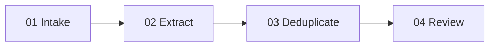

# Excavation — chat and project archaeology pipeline

One job: turn bounded source packets into reviewed Atlas candidates while retaining provenance.

Each stage reads only its contract and named inputs. The human gate is `04_review/output/approval.md`; nothing enters the Atlas automatically.

