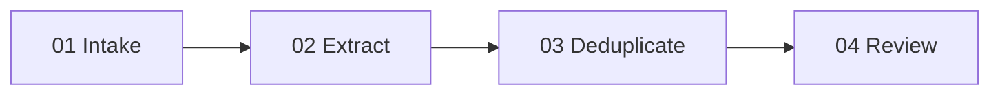

# Excavation — chat and project archaeology pipeline

One job: turn bounded source packets into reviewed Atlas candidates while retaining provenance.

`stages/` owns the reusable contracts. Real executions live under `runs/<run-id>/` with stage-named subdirectories so a later run never overwrites prior evidence.

Each stage reads only its contract and named inputs. A run reaches its human gate at `runs/<run-id>/04_review/approval.md`; nothing enters the Atlas automatically.

First proof run: `runs/2026-09-02-jeoparody-blueprint/`.
